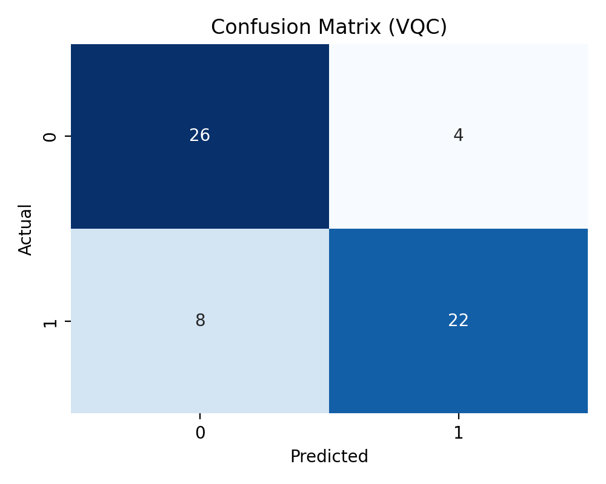

# Quantum Machine Learning Research: Hybrid VQC vs. Quantum Kernel SVM


---

## Overview

This repository contains an **advanced Quantum Machine Learning (QML) application** for **binary classification**, such as biomedical or financial datasets.  
It provides a comparison between:

- **Hybrid Variational Quantum Classifier (VQC)** — hybrid quantum-classical model trained with **PyTorch + PennyLane**.
- **Quantum Kernel Support Vector Machine (QSVM)** — quantum kernel model leveraging **PennyLane + scikit-learn**.

**Status:** Undergraduate Research Project (Semester 3)  
**Key Highlight:** Hybrid evaluation pipeline combining quantum circuits and classical ML.

---

## Key Features & Highlights

- **Hybrid VQC:** Layered hardware-efficient ansatz, gradient-based optimization via Adam.  
- **Quantum Kernel SVM:** Feature mapping to quantum Hilbert space, kernel-based classical SVM.  
- **Modular architecture:** YAML-config driven, flexible for new datasets and experiments.  
- **Automatic artifacts:** Trained models, metrics, and confusion matrices stored in `artifacts/`.  
- **CLI & Logging:** Powered by **Typer** and **Rich** for clean command-line execution and logging.  
- **Customizable experiments:** Shots, feature layers, variational layers, and early stopping can be tuned.

---

## Technology Stack

| Component                  | Library/Framework       | Notes                             |
|----------------------------|-----------------------|----------------------------------|
| Quantum ML (VQC)           | PennyLane             | Hybrid quantum-classical model   |
| Quantum ML (QSVM)          | PennyLane + Qiskit    | Quantum kernel computation       |
| Classical ML / SVM         | Scikit-learn          | QSVM classifier                  |
| Deep Learning / Optimizer  | PyTorch               | Gradient-based VQC training      |
| CLI & Logging              | Typer, Rich           | Command-line interface & logging |
| Config Management          | PyYAML                | YAML configuration files         |
| Numerical Computation      | NumPy                 | Data preprocessing               |

---

## Methodology

### Hybrid Variational Quantum Classifier (VQC)
- **Ansatz:** Layered Hardware-Efficient Circuit  
- **Feature Encoding:** Classical features mapped to qubits using rotation gates  
- **Optimizer:** Adam  
- **Framework:** PennyLane + PyTorch  
- **Training:** Early stopping, configurable shots, batch-based gradient updates  

### Quantum Kernel SVM (QSVM)
- **Quantum Feature Map:** ZZFeatureMap  
- **Kernel:** Quantum state fidelity  
- **Classifier:** Classical SVM (Scikit-learn)  
- **Framework:** PennyLane + Scikit-learn  

---

## Results and Analysis

| Model                   | Accuracy | F1 Score |
|-------------------------|---------|----------|
| Hybrid VQC              | 70%     | 0.70     |
| Quantum Kernel SVM (QSVM)| 75%     | 0.75     |
| Classical SVM (baseline)| 80%     | 0.81     |

**Key Finding:** QSVM slightly outperforms VQC in raw metrics, but **VQC provides a flexible hybrid approach** that allows integration with classical neural pipelines.  



> Click the image to view the full **Confusion Matrix** in `artifacts/`.

---
## Contact & License

- **Author:** Rasidi Ece, Undergraduate Student (Semester 3)  
- **Email:** rasidi@example.com  
- **GitHub:** [https://github.com/rasidi3112](https://github.com/rasidi3112)  

**License:** MIT License  
---

**Disclaimer:** This repository is intended for **research and educational purposes** in Quantum Machine Learning experimentation.


## Project Structure

```plaintext
qml_app/
├─ config/
│  └─ default.yaml
├─ qml_app/
│  ├─ __init__.py
│  ├─ config.py
│  ├─ data.py
│  ├─ evaluation.py
│  ├─ main.py
│  ├─ models.py
│  ├─ qnn_layers.py
│  ├─ training.py
│  └─ utils/
│     ├─ __init__.py
│     ├─ config_utils.py
│     ├─ logging_utils.py
│     └─ seed.py
└─ requirements.txt


---

## How to Run

```bash
# 1. Create & activate virtual environment
python -m venv .venv
source .venv/bin/activate      # Windows: .venv\Scripts\activate

# 2. Install dependencies
pip install -r requirements.txt

# 3. Train Hybrid VQC
python -m qml_app.main train --model vqc --config config/default.yaml

# 4. Train Quantum Kernel SVM
python -m qml_app.main train --model kernel --config config/default.yaml

# 5. Evaluate VQC
python -m qml_app.main evaluate --model vqc --config config/default.yaml


---

